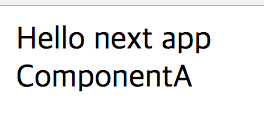

# typescript-monorepo-next-example



> 🙉🙉 TypeScript Monorepo Sample  
Required TypeScript@3 above

## Create monorepo with next.js

### Prerequisition
`yarn`

### Create monorepo

```bash

$ mkdir typescript-monorepo && cd $_
$ yarn init -y -p
```

- edit [package.json](package.json#L7-L14) # setup workspace and scripts

```bash
$ mkdir -p packages/app && cd $_
$ yarn init -y
$ yarn add -D typescript @types/react
$ yarn add next react react-dom @zeit/next-typescript
$ mkdir pages
$ touch pages/index.tsx next.config.js .babelrc.js tsconfig.json
$ cd ../.. # change root directory
```

- edit [packages/app/next.config.js](packages/app/next.config.js)
- edit [packages/app/.babelrc.js](packages/app/.babelrc.js)
- edit [packages/app/tsconfig.json](packages/app/tsconfig.json)
- edit packages/app/package.json
  - [packages/app/package.json](packages/app/package.json#L6-L8) # add script
  - [packages/app/package.json](packages/app/package.json#L16) # add package(component-a) dependency
- edit [packages/app/pages/index.tsx](packages/app/pages/index.tsx) # add default page and load component from package

### Configure typescript monorepo
- create [packages/tsconfig.json](packages/tsconfig.json)
- create [packages/tsconfig.base.json](packages/tsconfig.base.json)

### Create component

```bash
$ mkdir -p packages/component-a && cd $_
$ yarn init -y
$ yarn add -D typescript @types/react
$ yarn add react
$ touch index.tsx tsconfig.json
$ cd ../.. # change root directory
```

- edit [packages/component-a/index.tsx](packages/component-a/index.tsx) # add default page and load component from package
- edit [packages/component-a/tsconfig.json](packages/component-a/tsconfig.json) # add default page and load component from package

```bash
$ yarn
$ yarn build:packages # or yarn build:packages:watch
$ yarn start
```

### Related

- [typescript-monorepo-cra-example](https://github.com/deptno/typescript-monorepo-cra-example) - CRA(`create-react-app`) version
- [next.js-typescript-starter-kit](https://github.com/deptno/next.js-typescript-starter-kit) - Next.js TypeScript starter kit
